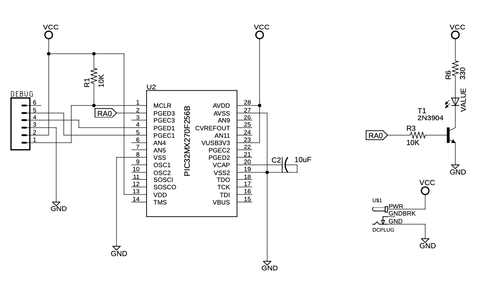

# VerifyLED

This simple project tests the connection of a PIC32MX CPU (the [PIC32MX270F256B](https://www.microchip.com/wwwproducts/en/PIC32mx270f256b) CPU) to the [MPLab PICKit 4 In-Circuit Debugger](https://www.microchip.com/Developmenttools/ProductDetails/PG164140).

This consists of a very simple program which pulses a single LED on and off about once a second. This assumes the following basic circuit:

The circuit block on the left is the absolute minimum circuit (as far as I can determine) necessary to run the PIC32MX270F256B MPU. This (and the configuration code) runs the MPU at 48MHz from an internal oscillator.

The capacitor C2 must be a non-polarized ceramic capacitor; I used one from [this collection of capacitors off Amazon](https://www.amazon.com/gp/product/B07PRC5JJY/). The 10K pull-up resistor can be any 10K-ish resistors, such as one from [this set of resistors.](https://www.amazon.com/dp/B08FHLTV1M/)

(Note: I tend to blow through 10K resistors as pull-ups, so I generally buy them [in sets of 100 to 1000.](https://www.amazon.com/Projects-100EP51410K0-10k-Resistors-Pack/dp/B0185FGYQA/))

The LED and resistors are "suggested"; I generally power the whole thing at 3.3v, and any reasonable resistor from 330 ohms to 470 ohms will do the trick. I also like [these LEDs](https://www.amazon.com/gp/product/B00UWBJM0Q/); they're pretty.

I also put the LED behind a transistor in order to reduce the load on the PIC32MX MPU's pin, but you can probably skip this step and connect the LED and resistor directly to the MPU.

The plug is [one of these guys](https://www.amazon.com/gp/product/B074LK7G86/), and the Eagle board layout accepts one of these. The adapter that plugs into this plug is [one of these.](https://www.amazon.com/gp/product/B07CR2M8W6/)

----

The software itself configures the PIC32 to operate at 48MHz using the internal 8MHz oscillator. 

And this includes the files "timers.h" and "timers.c" which sets Timer 1 on the MPU as a periodic timer that drives an internal interrupt at 100 Hz. This is then used to increment an internal counter.
